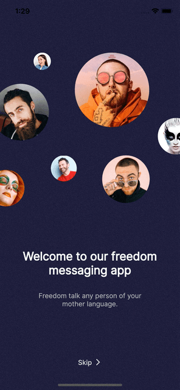

<!-- PROJECT LOGO -->
<br />
<p align="center">

  

  <h3 align="center">Flutter Chat App</h3>

  <p align="center">
    Flutter Chat App is a Flutter Chat App Template used to test real chat functionallity using HTTP. Later I'll be trying to make it work with websockets.
    <br />
   </p>
</p>
<!-- TABLE OF CONTENTS -->
<details open="close">
  <summary>Contents</summary>
  <ol>
    <li>
      <a href="#about-the-project">About the project</a>
      <ul>
        <li><a href="#built-with">Built With</a></li>
      </ul>
    </li>
    <li><a href="#installation">Installation</a></li>
    <li><a href="#license">License</a></li>
  </ol>
</details>

<!-- ABOUT THE PROJECT -->

## About the Project

  <p align="center">
  
  </p>
  </br>

Flutter Chat App is a Flutter Chat App Template used to test real chat functionallity.

### Built With

- [Flutter](https://flutter.dev/)
- [Dart](https://dart.dev/)

## Installation

1. clone this repo.

   ```sh
   git clone git@github.com:paahdiego/FlutterChatApp.git

   ou

   git clone https://github.com/paahdiego/FlutterChatApp.git
   ```

2. install dependencies:

   ```sh
   flutter pub get
   ```

3. run:
   ```sh
   flutter run
   ```

<!-- LICENSE -->

## License

Distributed under the MIT License. See `LICENSE` for more information.
